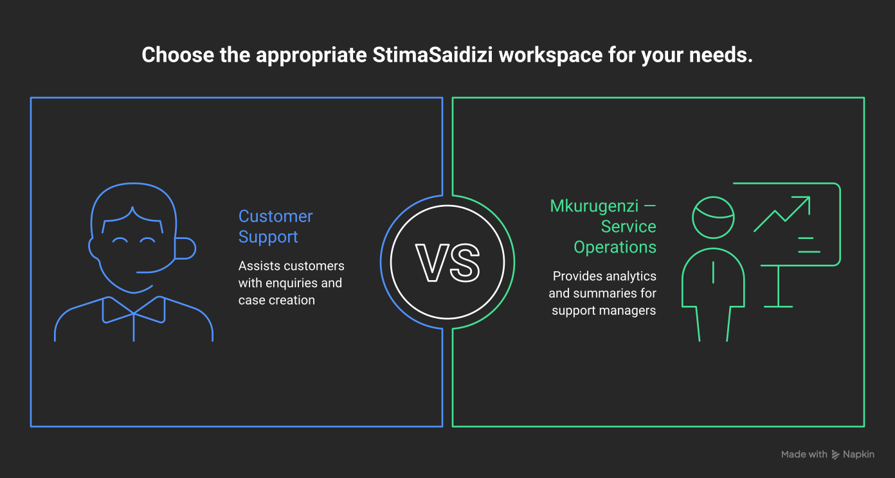
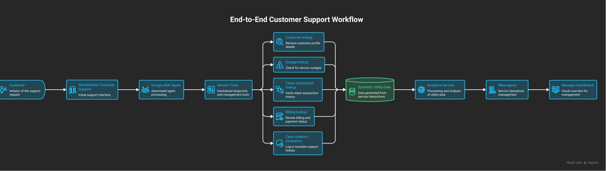
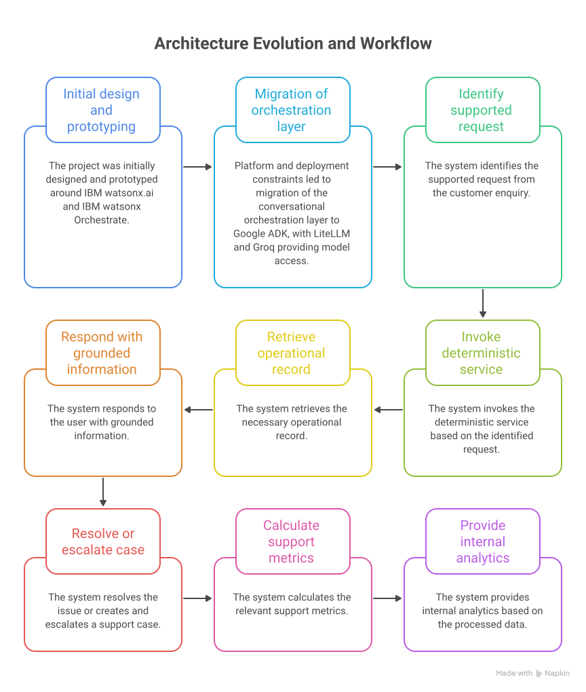

# StimaSaidizi

**AI-assisted electricity customer support and service-operations prototype for a Kenyan utility context.**

StimaSaidizi demonstrates how conversational AI can support recurring electricity customer-service enquiries while providing internal service analytics from the same operational data.

The project was developed as a solo **IBM Phase 3 Cornerstone Project** under the **Product Development pathway**, within the **Energy & Manufacturing** sector.

### Live Demo

**StimaSaidizi is deployed on Streamlit Community Cloud:**

[Launch StimaSaidizi](https://stimasaidizi-3xf7dh9e52sstskjqn6exv.streamlit.app/)

> **Demonstration environment:** StimaSaidizi uses synthetic customer, billing, token, outage and support-case data. It is not an official Kenya Power service and does not connect to live utility systems.

---

## StimaSaidizi Workspaces

<p align="center">
  
</p>

StimaSaidizi provides two connected workspaces:

### Customer Support

The customer-facing assistant supports:

- Power outage and fault enquiries
- Prepaid-token transaction checks
- Billing enquiries
- Support-case creation
- Support-case escalation

Responses are grounded in the project's service layer and synthetic records. The assistant is designed not to invent outage restoration estimates, prepaid-token information, billing values, or support-case actions.

### Mkurugenzi — Service Operations

Mkurugenzi is the internal analytics assistant for support managers.

It provides grounded summaries of:

- Total support cases
- Cases by category
- Cases by status
- Resolution rate
- Escalation rate
- Average resolution time
- Resolution time by location class
- Unresolved support cases
- Common enquiry categories

Operational metrics are calculated deterministically by the analytics service before being presented by the AI assistant.

The two workspaces operate over the same support-service data, allowing customer interactions and created support cases to feed the internal analytics workflow.

---

## End-to-End Customer Support Workflow

<p align="center">
  
</p>

The customer-facing and management features are connected through a shared service and data layer.

A typical workflow is:

1. A customer submits a service enquiry.
2. StimaSaidizi identifies the supported request.
3. The Google ADK agent invokes the appropriate deterministic service tool.
4. The service retrieves information from the synthetic utility dataset.
5. StimaSaidizi returns a grounded response.
6. If necessary, a support case is created or escalated.
7. Support-case data is processed by the analytics service.
8. Mkurugenzi uses calculated metrics and case records to provide operational summaries to support managers.

This shared workflow allows a support case created through Customer Support to become visible to the Internal Analytics feature.

---

## Architecture Evolution

<p align="center">
  
</p>

StimaSaidizi was initially designed and prototyped around **IBM watsonx.ai** and **IBM watsonx Orchestrate**, following the original Cornerstone project plan.

The application was deliberately structured so that the AI and orchestration layer remained separate from the deterministic Python service layer.

During implementation, platform availability and deployment constraints led to migration of the conversational orchestration layer to **Google Agent Development Kit (ADK)**. Model access is provided through **LiteLLM** and **Groq**, while the existing service logic, FastAPI routes, synthetic datasets, tests, and functional workflows were retained.

The original IBM integration artifacts remain in the repository as part of the project's implementation history.

The resulting implementation therefore preserves the original functional design while allowing the orchestration and model-access layers to evolve independently.

---

## Technology Stack

| Layer | Technology |
|---|---|
| User interface | Streamlit |
| Agent framework | Google Agent Development Kit (ADK) |
| LLM abstraction | LiteLLM |
| Language model | GPT-OSS via Groq |
| Application logic | Python |
| API layer | FastAPI |
| Data layer | Synthetic JSON datasets |
| Analytics | Deterministic Python service layer |
| Testing | pytest |
| Containerisation | Docker |
| Deployment | Streamlit Community Cloud |

---

## System Design

StimaSaidizi separates conversational AI from deterministic application logic.

The language model provides the conversational and explanation layer, while operational information is obtained through application tools and services.

The core flow is:

```text
Customer enquiry
        |
        v
Identify supported request
        |
        v
Invoke deterministic service
        |
        v
Retrieve operational record
        |
        v
Respond with grounded information
        |
        v
Resolve / create / escalate support case
        |
        v
Calculate support metrics
        |
        v
Provide internal analytics
```

This separation reduces reliance on model-generated operational information. Customer records, outage information, token status, billing information, support-case state, and management metrics originate from the application's service and data layers.

---

## Core Services

The service layer contains:

| Service | Responsibility |
|---|---|
| `customer_service.py` | Customer record lookup |
| `outage_service.py` | Outage lookup and restoration-status handling |
| `token_service.py` | Prepaid-token transaction lookup |
| `billing_service.py` | Customer billing lookup |
| `case_service.py` | Support-case creation and escalation |
| `analytics_service.py` | Deterministic support metrics and unresolved-case analysis |

This separation helps ensure that customer-specific and operational information comes from application data rather than being fabricated by the language model.

---

## Project Structure

```text
StimaSaidizi/
├── agents/
│   ├── customer_support/
│   │   ├── agent.py
│   │   └── tools.py
│   └── mkurugenzi/
│       ├── agent.py
│       └── tools.py
│
├── api/
│   ├── main.py
│   ├── auth.py
│   └── routes/
│       ├── analytics.py
│       ├── billing.py
│       ├── customers.py
│       ├── outages.py
│       ├── support_cases.py
│       └── tokens.py
│
├── data/
│   ├── bills.json
│   ├── customers.json
│   ├── outages.json
│   ├── support_cases.json
│   └── token_transactions.json
│
├── docs/
│   ├── architecture/
│   │   ├── workspace-overview.svg
│   │   ├── end-to-end-workflow.svg
│   │   └── architecture-evolution.svg
│   └── orchestrate/
│
├── frontend/
│   └── app.py
│
├── services/
│   ├── analytics_service.py
│   ├── billing_service.py
│   ├── case_service.py
│   ├── customer_service.py
│   ├── outage_service.py
│   └── token_service.py
│
├── tests/
├── .streamlit/
├── Dockerfile
├── requirements.txt
└── README.md
```

---

## Customer Support Agent

The StimaSaidizi customer-support agent handles recurring electricity-service enquiries using tools connected to the project's deterministic service layer.

### Outages and Faults

The assistant can check recorded outage information for an area.

It does not invent:

- Outage causes
- Restoration estimates
- Technician dispatches
- Field actions

If a recorded restoration estimate has already passed and no updated estimate exists, the assistant reports that situation rather than generating a new restoration time.

### Prepaid Tokens

The assistant can verify a recorded prepaid-token transaction and distinguish between:

- Payment status
- Token issuance status

A successful payment therefore does not automatically mean that the corresponding token has already been issued.

### Billing

The assistant retrieves billing information from the synthetic billing dataset.

It does not perform real payments or access real utility accounts.

### Support Cases

When an enquiry cannot be resolved using the available records, the assistant can invoke the case-management service to create or escalate a support case.

A case ID is only reported after successful creation by the backend service.

Cases created through the customer-facing workflow subsequently become available to the internal analytics layer.

---

## Mkurugenzi — Internal Analytics

Mkurugenzi provides a natural-language interface to the project's internal customer-support analytics.

Instead of asking the language model to calculate operational statistics, the application first calculates metrics using the deterministic analytics service.

Mkurugenzi then explains those results in concise management-oriented language.

Supported analytics include:

```text
total_cases()
cases_by_category()
cases_by_status()
resolution_rate()
escalation_rate()
average_resolution_time()
average_resolution_time_by_location_class()
unresolved_cases()
most_common_enquiry_category()
```

Mkurugenzi is instructed not to claim that operational performance is improving or worsening unless appropriate historical comparison data exists.

A zero or missing metric is interpreted according to the available records rather than automatically being treated as evidence of zero performance.

---

## AI Guardrails

StimaSaidizi uses behavioural constraints to keep responses grounded in the demonstration data.

### Customer Support

The customer-facing assistant must:

- Use retrieved service records for operational answers
- Ask for required identifiers when they are missing
- State when requested information is unavailable
- Avoid fabricating outage restoration times
- Avoid fabricating outage causes
- Avoid fabricating prepaid-token status
- Avoid fabricating billing values
- Avoid inventing support-case IDs
- Avoid claiming unsupported field or human-agent actions
- Create or escalate cases only through the corresponding service tools

### Mkurugenzi

The internal analytics assistant must:

- Use calculated analytics as its source of truth
- Avoid inventing counts or percentages
- Avoid inventing customer or case details
- Avoid unsupported causal explanations
- Avoid claiming trends without historical evidence
- Explain missing or zero-value metrics appropriately

---

## Demonstrated End-to-End Scenarios

The deployed prototype has been manually tested with representative customer-support and management workflows.

### Prepaid-Token Enquiry

A customer can request help with a prepaid-token transaction.

The assistant requests the transaction reference, retrieves the transaction through the token service, and distinguishes between payment status and token-issuance status.

For example, the demonstration dataset contains scenarios where payment has succeeded while token issuance remains pending.

### Billing Enquiry and Case Creation

A customer can report a billing problem.

When the available billing information cannot resolve the enquiry, StimaSaidizi can create a support case through the case-management service and return the backend-generated case ID and status.

### Internal Operational Summary

Mkurugenzi can retrieve calculated support metrics and provide a concise operational summary including case volumes, categories, statuses, resolution rates, escalation rates, and resolution times.

### Shared Case Workflow

A support case created through the customer-facing workspace becomes available to the internal analytics workflow.

This demonstrates that Customer Support and Internal Analytics are not isolated chatbot demonstrations. They operate over a shared support-service data flow.

---

## Running Locally

### 1. Clone the Repository

```bash
git clone https://github.com/jaGaban747/StimaSaidizi.git
cd StimaSaidizi
```

### 2. Create a Virtual Environment

```bash
python -m venv .venv
source .venv/bin/activate
```

### 3. Install Dependencies

```bash
pip install -r requirements.txt
```

### 4. Configure Model Access

Configure the required Groq API credential using a local `.env` file.

For example:

```text
GROQ_API_KEY=<your-api-key>
```

Secret and credential files are excluded from source control and must not be committed to the repository.

### 5. Start the Streamlit Application

```bash
streamlit run frontend/app.py
```

### 6. Optional ADK Development Interface

For local Google ADK development:

```bash
PYTHONPATH="$PWD" adk web agents
```

---

## Testing

Run the deterministic service tests with:

```bash
pytest -q
```

The test suite covers the core customer, outage, token, billing, and support-case service behaviour.

The deployed application has additionally been manually verified through both the Customer Support and Mkurugenzi workflows.

---

## Deployment

The demonstration application is deployed using **Streamlit Community Cloud**.

The repository also contains a `Dockerfile` developed and locally validated for container-based deployment.

Deployment credentials are supplied through the hosting platform's secret-management mechanism rather than being stored in source control.

---

## Data and Security

The Cornerstone implementation uses synthetic data only.

The repository does not contain real Kenya Power:

- Customer records
- Billing records
- Prepaid-token records
- Payment information
- Outage records
- Operational records

Secrets such as model API credentials are excluded from source control.

Any future production implementation would require appropriate authentication, authorisation, encryption, audit logging, data-retention controls, and regulatory review before processing real customer information.

---

## Current Prototype Limitations

StimaSaidizi is an educational prototype rather than a production utility platform.

Current limitations include:

- Synthetic utility data only
- No connection to live Kenya Power operational systems
- No real payment processing
- No production customer authentication
- No production SMS or USSD integration
- No WhatsApp Business integration
- No field-service dispatch integration
- No production utility database
- No durable production case-storage mechanism
- No production regulatory or compliance certification

The Streamlit deployment uses the prototype data layer. Runtime writes should therefore not be treated as durable production database storage and may be lost when the application instance is restarted or redeployed.

---

## Future Development

Potential extensions include:

- Persistent database storage
- Production authentication and role-based access
- Secure integration with utility outage-management systems
- Secure billing-system integration
- Authorised prepaid-token and payment verification
- SMS and USSD channels
- WhatsApp Business integration
- Field-service integration
- Geospatial outage visualisation
- Customer-support volume forecasting
- Expanded multilingual support
- Audit and observability infrastructure

Any real-world implementation would also require appropriate regulatory, privacy, security, and operational validation.

---

## Project Context

StimaSaidizi was developed as a solo **IBM Phase 3 Cornerstone Project** under the **Product Development pathway** in the **Energy & Manufacturing** sector.

The project demonstrates two connected Audience Features:

1. **Customer Support**
2. **Internal Analytics**

The original project plan proposed **IBM watsonx.ai** and **IBM watsonx Orchestrate** as the primary AI technologies.

The final implementation retains the original project objectives and deterministic service architecture while demonstrating how a modular design allowed the conversational orchestration layer to evolve when platform constraints were encountered.

The project's central design principle is:

> **AI provides the conversational interface and explanation layer; deterministic application services remain the source of truth for operational information.**

---

## Author

**Leon Changara Chemwor Odari**

IBM Phase 3 Cornerstone Project  
Product Development — Energy & Manufacturing  
Kenya